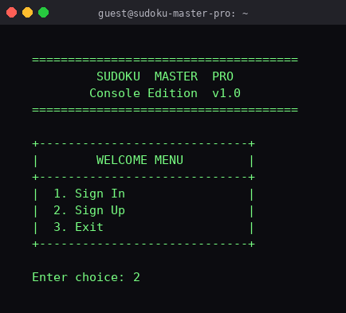
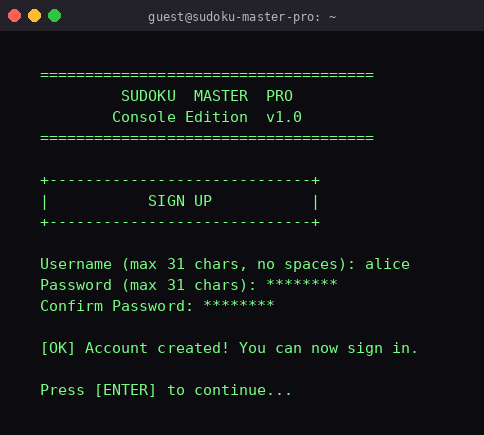
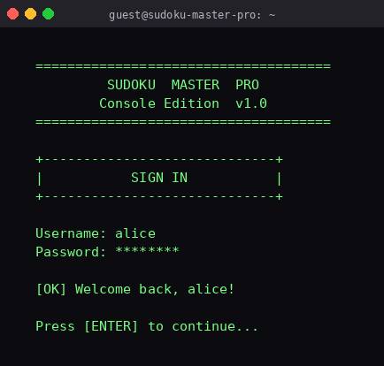
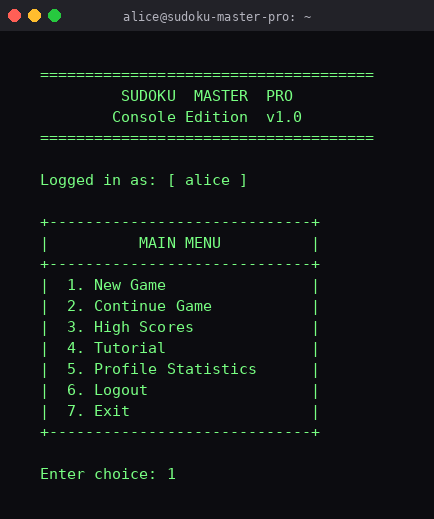
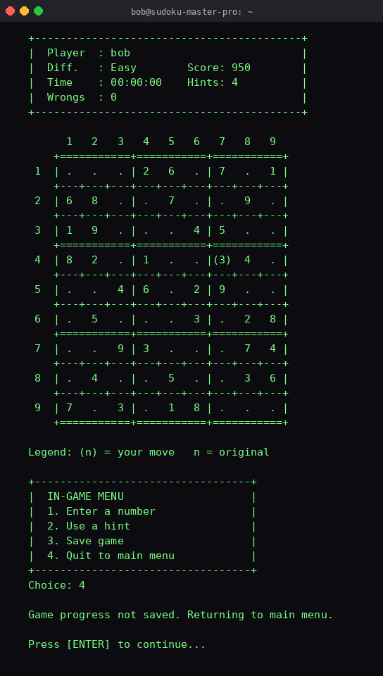
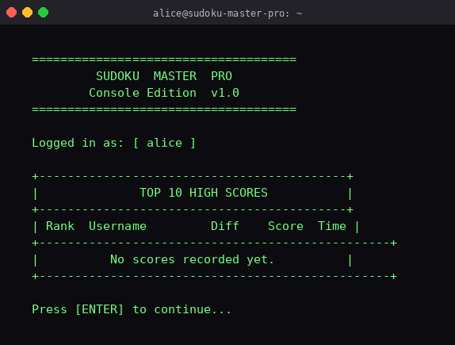
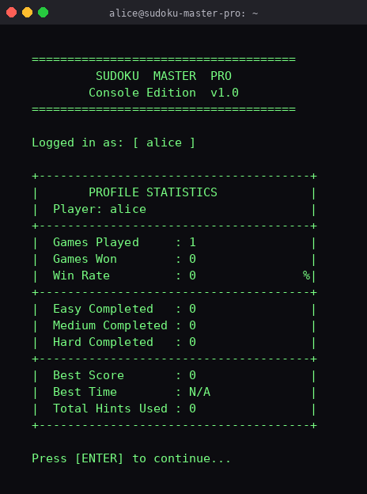
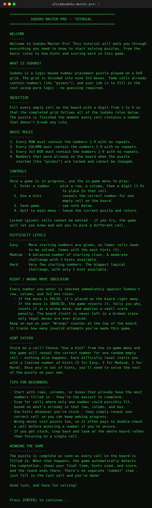

<div align="center">

# 🧩 Sudoku Master Pro

### A Console-Based Sudoku Management System · Console Edition v1.0

**A complete, file-backed Sudoku application written in pure C — combining user accounts, persistent saves, hints, transparent scoring, a leaderboard, and player statistics in a single, dependency-free console binary.**


> ⚠️ Replace `your-username/sudoku-master-pro` in the badge URLs above with your real GitHub `owner/repo` path once you push — otherwise these will render as broken/zero.

</div>

---

## 📑 Table of Contents

- [Project Overview](#-project-overview)
- [Team Members](#-team-members)
- [Features](#-features)
- [Screenshots](#-screenshots)
- [Project Architecture](#-project-architecture)
- [Folder Structure](#-folder-structure)
- [Technologies Used](#-technologies-used)
- [Algorithms Used](#-algorithms-used)
- [Data Structures](#-data-structures)
- [Game Flow](#-game-flow)
- [Installation](#-installation)
- [Controls](#-controls)
- [File Handling](#-file-handling)
- [Proposal vs. Implementation](#-proposal-vs-implementation)
- [Future Improvements](#-future-improvements)
- [Learning Outcomes](#-learning-outcomes)
- [Limitations](#-limitations)
- [Contributing](#-contributing)
- [License](#-license)
- [Authors](#-authors)
- [Acknowledgements](#-acknowledgements)

---

## 🎯 Project Overview

**Sudoku Master Pro** is a single-file, console-based Sudoku application built in ANSI C as a Software Development Project (SDP) for the Department of Computer Science and Engineering, **BUBT**. It was proposed to fill a specific gap: most Sudoku applications are mobile-only, GUI-heavy, or require internet connectivity, leaving no lightweight, offline, multi-user reference implementation that demonstrates core C concepts — file handling, recursion, backtracking, and modular programming — in one cohesive project.

The delivered application is a full player-management system that combines **user authentication**, **persistent game saves**, a **hint engine**, a **transparent, formula-driven scoring model**, a **Top-10 leaderboard**, and **per-user statistics tracking**, all rendered through a hand-drawn ASCII console interface.

📄 The full academic project proposal (needs analysis, existing-system comparison, development model, feasibility, and budget) is available in this repository — see [`docs/Sudoku_Master_Pro_Proposal.docx`](docs/Sudoku_Master_Pro_Proposal.docx).

Based on the source code actually implemented:

- 🔐 A real multi-user account system backed by binary `.dat` files, so progress persists across sessions.
- 🧠 A recursive backtracking solver computes the answer key for every puzzle the moment a game starts.
- 🎮 Five save slots with slot-level ownership checks, so a player can pause and resume later.
- 🏆 A live Top-10 leaderboard and a personal statistics dashboard (win rate, best score, best time, hints used).
- 📖 A built-in in-app tutorial screen explaining the rules, controls, and the exact scoring formula.

---

## 👥 Team Members

Developed by a team of three CSE students at **BUBT** as their Software Development Project, under the guidance of a faculty supervisor. Roles below reflect each member's primary area of responsibility as defined in the project proposal.

| ID | Name | Designation | Key Responsibilities |
|---|---|---|---|
| 20254103248 | Oalid Khan | Team Leader & Core Programmer | Overall coordination, authentication module, game loop, tutorial section, final integration and testing |
| 20254103245 | Muntaha Mou Jim | Back-end Programmer | Backtracking solver, hint system, scoring engine, save/load file I/O, leaderboard |
| 20254103257 | Antar Chandra Kar | Back-end Programmer | Board ASCII display, statistics module, cross-platform testing, documentation |

**Intake/Section:** 56/07 · **Faculty Supervisor:** Mastura Sadaf, Lecturer, Dept. of CSE, BUBT

---

## ✅ Features

### 🔐 Authentication
- ✅ User Registration (username + password, duplicate and space checks, minimum password length)
- ✅ Login (credential validation against stored user database)
- ✅ Logout (persists all data and clears the active session)

### 🎮 Gameplay
- ✅ New Game (choose Easy / Medium / Hard)
- ✅ Difficulty Selection with per-difficulty hint allowances (5 / 3 / 1)
- ✅ Board Display (formatted ASCII 9×9 grid with box dividers)
- ✅ Number Entry (row, column, digit input)
- ✅ Move Validation (row / column / 3×3 box rule checking)
- ✅ Locked Cell Protection (original given cells cannot be overwritten)
- ✅ Hint System (reveals a random correct cell, limited per difficulty)
- ✅ Score Calculation (base score, penalties, and bonuses)
- ✅ Wrong Move Penalty (score deduction + wrong-move counter)
- ✅ Completion Detection (automatic win check after every move)

### 💾 Data Management
- ✅ Save Game (up to 5 slots, per-user ownership)
- ✅ Continue Game (resume from any owned slot)
- ✅ User Database (binary file of up to 50 accounts)

### 🏆 Leaderboard
- ✅ Top 10 High Scores (persisted and re-sorted for display)
- ✅ Automatic insertion/replacement when a new score qualifies

### 📊 Statistics
- ✅ Per-user Games Played / Games Won tracking
- ✅ Per-difficulty completion counters (Easy / Medium / Hard)
- ✅ Best Score and Best Time tracking
- ✅ Total Hints Used tracking
- ✅ Win Rate calculation on display

### 📖 Tutorial
- ✅ In-app rules explanation
- ✅ Controls guide
- ✅ Difficulty & hints overview
- ✅ Scoring system breakdown
- ✅ Board legend explanation

### 🖥️ Console Interface
- ✅ Bordered ASCII menus throughout
- ✅ Formatted board rendering with locked/user-entered cell distinction
- ✅ Persistent storage auto-saved on logout/exit and after each game

---

## 🖼️ Screenshots

> Captured directly from the compiled `SudukuMasterPro.c` binary running in a terminal.

| Welcome Screen | Sign Up | Sign In |
|---|---|---|
|  |  |  |

| Main Menu | Gameplay |
|---|---|
|  |  |

| Leaderboard | Statistics |
|---|---|
|  |  |

| Tutorial |
|---|
|  |

> The Leaderboard and Statistics screens above show a freshly registered account's empty state (no games completed yet) — an accurate first-run view rather than staged data.

---

## 🏗️ Project Architecture

```
                ┌───────────────────────┐
                │  Load Persistent Data │
                │ (users/saves/scores/  │
                │     statistics)       │
                └───────────┬───────────┘
                            ↓
                ┌────────────────────────┐
                │   Authentication Menu  │
                │   (Sign In / Sign Up)  │
                └───────────┬────────────┘
                            ↓
                ┌────────────────────────┐
                │        Main Menu       │
                └───────────┬────────────┘
                            ↓
        ┌───────────────────┼──────────────────────┐
        ↓                   ↓                      ↓
┌────────────────┐  ┌────────────────┐   ┌─────────────────────┐
│   New Game     │  │ Continue Game  │   │  High Scores /      │
│ (pick puzzle)  │  │ (load a slot)  │   │  Statistics/Tutorial│
└───────┬────────┘  └───────┬────────┘   └──────────┬──────────┘
        └───────────┬───────┘                       │
                    ↓                               │
            ┌─────────────────┐                     │
            │     Gameplay    │←────────────────────┘
            │ (enter numbers, │
            │  hints, save)   │
            └────────┬────────┘
                     ↓
            ┌───────────────────┐
            │ Score Calculation │
            └────────┬──────────┘
                     ↓
        ┌─────────────────────────────┐
        │  Leaderboard & Statistics   │
        │        Update + Save        │
        └─────────────────────────────┘
```

---

## 📂 Folder Structure

```
Sudoku-Master-Pro/
│
├── SudukuMasterPro.c    # Complete source (auth, gameplay, solver, scoring, stats)
├── users.dat             # Generated at runtime — user accounts
├── saves.dat             # Generated at runtime — up to 5 save-game slots
├── highscores.dat         # Generated at runtime — Top 10 high scores
├── statistics.dat         # Generated at runtime — per-user statistics
├── docs/
│   └── Sudoku_Master_Pro_Proposal.docx   # Official project proposal
├── screenshots/           # README screenshots
├── README.md
├── LICENSE
└── .gitignore
```

> The four `.dat` files are created automatically the first time the program runs (or the first time each is written) — they are not shipped with the source code.

---

## ⚙️ Technologies Used

| Technology | Usage in this Project |
|---|---|
| **C (ANSI C / C99)** | Core implementation language for all logic |
| **GCC** | Compiler used to build the console binary (GCC/MinGW), no external dependencies |
| **Standard C Library** | `stdio.h`, `stdlib.h`, `string.h`, `time.h`, `ctype.h` |
| **Structures** | Models `User`, `Game`, `Score`, and `Statistics` |
| **Arrays** | 9×9 board/solution/locked grids, fixed puzzle banks, user/save/score/statistics arrays |
| **File Handling** | Binary `fread`/`fwrite` persistence for all four data files (fixed-size structs) |
| **Recursion** | Recursive backtracking Sudoku solver |
| **Console Programming** | Hand-drawn ASCII boxes, menus, and board rendering via `printf` |

---

## 🧮 Algorithms Used

**Recursive Backtracking Sudoku Solver** (`solveSudoku`)
Scans the board for the next empty cell, tries digits 1–9, and recursively continues if a digit is valid — backtracking (resetting the cell to 0) whenever no valid path is found. This is used immediately after a puzzle is chosen to compute the full **answer key** (`solution` grid) used for hints and win-checking.

**Move Validation** (`isValidMove`)
Checks that a candidate number does not already exist in the same row, the same column, or the same 3×3 box before allowing a placement.

**Puzzle Selection** (`selectPuzzle`)
Not a generator — the game ships with **5 hand-curated puzzles per difficulty** (Easy, Medium, Hard; 15 puzzles total). `selectPuzzle` uses `rand() % 5` to pick one puzzle from the appropriate fixed bank each time a new game starts.

**Score Calculation** (`calculateScore`)
On completion: takes the running score (already reduced by wrong-move and hint penalties), subtracts a time penalty of `elapsed_seconds / 10`, adds a `+500` completion bonus, and adds a `+200` bonus if zero hints were used. The result is floored at a minimum of `1`.

**Leaderboard Sorting** (`showHighScores`)
Uses a **selection sort** (descending by score) on a temporary copy of the score array purely for display ordering — the underlying stored array is not re-ordered.

**Leaderboard Insertion** (`updateLeaderboard`)
Finds the first empty score slot, or otherwise the slot with the lowest score; if that slot is empty or the new score beats it, the new score replaces it, keeping the file capped at the Top 10.

**Statistics Update** (`updateStatistics`)
On every game (win or quit), increments `gamesPlayed` and adds hints used to `totalHints`. On a win, increments `gamesWon`, the relevant difficulty completion counter, and updates `bestScore`/`bestTime` if the new game beats the previous best.

---

## 🗂️ Data Structures

### `User`
| Field | Type | Purpose |
|---|---|---|
| `username` | `char[32]` | Account username |
| `password` | `char[32]` | Account password (stored in plain text) |
| `active` | `int` | `1` if this slot holds a registered account |

### `Game`
| Field | Type | Purpose |
|---|---|---|
| `username` | `char[32]` | Owner of this game/save |
| `board` | `int[9][9]` | Current state of the puzzle |
| `solution` | `int[9][9]` | Fully solved answer key (computed via backtracking) |
| `locked` | `int[9][9]` | Marks original given cells (cannot be edited) |
| `difficulty` | `int` | `1`=Easy, `2`=Medium, `3`=Hard |
| `hintsLeft` | `int` | Remaining hints for this game |
| `wrongMoves` | `int` | Count of invalid move attempts |
| `hintsUsed` | `int` | Count of hints used so far |
| `score` | `int` | Running score during play |
| `startTime` | `time_t` | Timestamp when the game began |
| `active` | `int` | `1` if this slot holds a live/saved game |
| `slot` | `int` | Save-slot index (`-1` if not yet saved) |

### `Score`
| Field | Type | Purpose |
|---|---|---|
| `username` | `char[32]` | Player who achieved the score |
| `difficulty` | `int` | Difficulty the score was earned on |
| `score` | `int` | Final score value |
| `timeTaken` | `long` | Seconds taken to complete the puzzle |
| `active` | `int` | `1` if this leaderboard slot is filled |

### `Statistics`
| Field | Type | Purpose |
|---|---|---|
| `username` | `char[32]` | Player these stats belong to |
| `gamesPlayed` | `int` | Total games started |
| `gamesWon` | `int` | Total games completed |
| `easyCompleted` | `int` | Easy puzzles completed |
| `mediumCompleted` | `int` | Medium puzzles completed |
| `hardCompleted` | `int` | Hard puzzles completed |
| `bestScore` | `int` | Highest score achieved |
| `bestTime` | `long` | Fastest completion time in seconds (`0` = unset) |
| `totalHints` | `int` | Cumulative hints used across all games |
| `active` | `int` | `1` if this statistics slot is in use |

---

## 🔄 Game Flow

1. **Startup** — `main()` calls `loadAllData()`, reading `users.dat`, `saves.dat`, `highscores.dat`, and `statistics.dat` (missing files simply start empty).
2. **Authentication** — The Welcome Menu loops until the player signs in or registers a new account (or exits, which also saves all data).
3. **Main Menu** — Once logged in, the player chooses: New Game, Continue Game, High Scores, Tutorial, Profile Statistics, Logout, or Exit.
4. **New Game** — The player picks a difficulty; a random puzzle is loaded from the matching fixed bank, its solution is computed via the backtracking solver, and original cells are marked as locked.
5. **Continue Game** — The player selects one of their own occupied save slots to resume.
6. **Gameplay Loop** — Each turn the board is redrawn with player info, timer, score, and hints; the player enters a number, uses a hint, saves the game, or quits to the main menu.
7. **Move Handling** — Valid moves are placed on the board; invalid moves increment the wrong-move counter and deduct points; locked cells cannot be modified.
8. **Completion** — When the board has no empty cells, the final score is calculated, the leaderboard and statistics are updated, and all data is saved.
9. **Quitting Mid-Game** — Choosing "Quit to main menu" records the attempt in statistics as a played-but-unwon game and does **not** save board progress unless the player explicitly used the Save option beforehand.
10. **Logout / Exit** — All in-memory data (users, saves, scores, statistics) is written back to disk before the program returns to the auth menu or terminates.

---

## 🚀 Installation

### For Windows (MinGW)
```bash
gcc SudukuMasterPro.c -o sudoku.exe
sudoku.exe
```

### For Linux
```bash
gcc SudukuMasterPro.c -o sudoku
./sudoku
```

### Compilation Command
```bash
gcc SudukuMasterPro.c -o sudoku
```

### Running Command

**Windows**
```bash
sudoku.exe
```

**Linux**
```bash
./sudoku
```

**System Requirements** (per project proposal): GCC 7.0+ (MinGW on Windows), ANSI C99 standard, any terminal window (minimum 80×25 characters), Windows 7+/Ubuntu 18.04+/macOS 10.14+ or any POSIX-compliant OS, under 5 MB free disk space.

---

## 🎮 Controls

| Action | Description |
|---|---|
| `1` (Auth Menu) | Sign In with an existing account |
| `2` (Auth Menu) | Sign Up for a new account |
| `3` (Auth Menu) | Exit the program |
| `1` (Main Menu) | Start a New Game |
| `2` (Main Menu) | Continue a saved Game |
| `3` (Main Menu) | View High Scores |
| `4` (Main Menu) | Open the Tutorial |
| `5` (Main Menu) | View Profile Statistics |
| `6` (Main Menu) | Logout |
| `7` (Main Menu) | Exit the program |
| `1` (In-Game Menu) | Enter a number (prompts for row, column, digit) |
| `2` (In-Game Menu) | Use a hint (reveals one correct cell) |
| `3` (In-Game Menu) | Save the current game to a slot |
| `4` (In-Game Menu) | Quit to the Main Menu |

---

## 💽 File Handling

All persistence uses raw binary `fread`/`fwrite` of fixed-size struct arrays — no text parsing is involved.

| File | Purpose |
|---|---|
| **`users.dat`** | Stores an array of up to 50 `User` records (username, password, active flag) |
| **`saves.dat`** | Stores an array of up to 5 `Game` records — one save slot per index, shared across all accounts but ownership-checked by username |
| **`highscores.dat`** | Stores an array of up to 10 `Score` records forming the global Top-10 leaderboard |
| **`statistics.dat`** | Stores an array of up to 50 `Statistics` records — one per registered user |

Each file is loaded once at startup (`loadAllData`) and rewritten (`saveAllData`) after logout, on exit, and after key events such as completing or quitting a game.

---

## 📋 Proposal vs. Implementation

The project proposal was written before implementation began, so a few proposal statements describe intent rather than the final `SudukuMasterPro.c`. For transparency:

| Proposal Statement | Status in Actual Code |
|---|---|
| Backtracking solver used for "solution generation, hint reveals, **and optional auto-solve**" | ✅ Solution generation and hints are implemented. ⚠️ **No auto-solve feature exists** — there is no menu option that lets the solver fill the board automatically for the player. |
| "Save/load system supporting up to 5 save slots **per session**" | ⚠️ The 5 slots are **global to the binary** (shared across all registered users), not 5 slots per individual user — ownership is checked by username string match against a shared `saves.dat` array. |
| "Deliver... a calibrated hint budget (5 / 3 / 1 hints respectively)" | ✅ Matches exactly — confirmed in `newGame()`. |
| "Transparent, formula-driven scoring system combining base score, wrong-move penalties, hint penalties, time penalties, and completion/no-hint bonuses" | ✅ Fully matches `calculateScore()`. |
| "Top-10 global high-score leaderboard and per-user statistics" | ✅ Fully matches `updateLeaderboard()` / `updateStatistics()`. |
| "Well-commented, modular codebase (1300+ lines)" | ✅ The submitted source is a single well-commented file organized into clearly separated modules (auth, gameplay, solver, persistence, scoring, stats, UI). |

Everything else in this README (Features, Algorithms, Data Structures, Game Flow, Limitations) is drawn directly from the actual source code, not the proposal.

---

## 🔮 Future Improvements

> These are **planned enhancements** from the project proposal's Future Works — none of the following exist in the current codebase.

- ⬜ Procedural Sudoku generator that creates unique, solvable puzzles at runtime (replacing the fixed 15-puzzle bank) for infinite replayability
- ⬜ Password hashing (e.g., SHA-256 via OpenSSL) for secure credential storage
- ⬜ Undo/Redo stack to revert incorrect moves without penalty
- ⬜ Port the UI to an ncurses or SDL2 front-end for colour display and mouse support, keeping the C back-end unchanged
- ⬜ Network leaderboard using POSIX sockets so players on different machines can compete on a shared scoreboard
- ⬜ Auto-note (candidate) system that marks possible numbers in empty cells to assist learners

---

## 🎓 Learning Outcomes

This project demonstrates practical application of:

- Structures (`struct`) for modeling real-world entities
- Multi-dimensional arrays for the Sudoku grid and puzzle banks
- Pointers for passing 2D arrays and struct references between functions
- Recursion and backtracking algorithm design
- Binary file handling for persistent storage
- Menu-driven program design
- Authentication and session state management
- Modular function organization
- Console programming with formatted `printf` output
- Algorithm design and problem solving (validation, scoring, leaderboard maintenance)
- Incremental development and collaborative software delivery as a team

---

## ⚠️ Limitations

As identified in the project proposal and confirmed by the source code:

- Console-only interface — no graphical display; visual appeal is limited to ASCII art.
- **Fixed puzzle bank** — contains 15 hand-curated puzzles (5 per difficulty), not a random generator; a true generator could guarantee unique-solution puzzles.
- **No network support** — the high-score leaderboard is limited to a single machine's `highscores.dat` file.
- **Plain-text password storage** — no hashing or encryption is applied to credentials.
- **Fixed-size limits** — maximum of 50 registered users and 5 total save slots (shared across all users, not 5 per user), limited by fixed-size struct arrays.
- **No undo/redo** — an incorrect move cannot be reverted during a game session.
- No input sanitization beyond basic space/length checks.
- The high-score table is a single global Top 10, not split per difficulty.
- Quitting a game mid-play without manually saving discards the current board state.
- An alternate box-drawing-character banner function exists in the source but is never actually invoked; the active UI uses plain ASCII characters only.

---

## 🤝 Contributing

Contributions are welcome! If you'd like to improve Sudoku Master Pro:

1. Fork the repository
2. Create a feature branch (`git checkout -b feature/your-feature`)
3. Commit your changes with clear messages
4. Push to your branch and open a Pull Request
5. Describe your changes and the motivation behind them

Please keep contributions consistent with the existing coding style and avoid introducing external dependencies beyond the standard C library.

---

## 📜 License

This project is licensed under the **MIT License** — see the [LICENSE](LICENSE) file for details.

---

## ✍️ Authors

Developed as a Software Development Project (SDP) for the **Department of Computer Science and Engineering, BUBT** (Bangladesh University of Business and Technology), Intake/Section 56/07, under the supervision of **Mastura Sadaf**, Lecturer, Dept. of CSE, BUBT.

| Name | ID |
|---|---|
| **Oalid Khan** | 20254103248 |
| **Muntaha Mou Jim** | 20254103245 |
| **Antar Chandra Kar** | 20254103257 |

---

## 🙏 Acknowledgements

- **BUBT, Department of Computer Science and Engineering**, for the academic context and support
- **Mastura Sadaf**, Lecturer, Dept. of CSE, BUBT — faculty supervisor for this project
- The **GCC/MinGW** development team for the tooling that made this project possible
- The wider **Sudoku enthusiast community** for inspiration

---

<div align="center">

⭐ **If you found this project useful, consider giving it a star!**

Developed with ❤️ in C by:

**Oalid Khan** · **Muntaha Mou Jim** · **Antar Chandra Kar**

</div>
